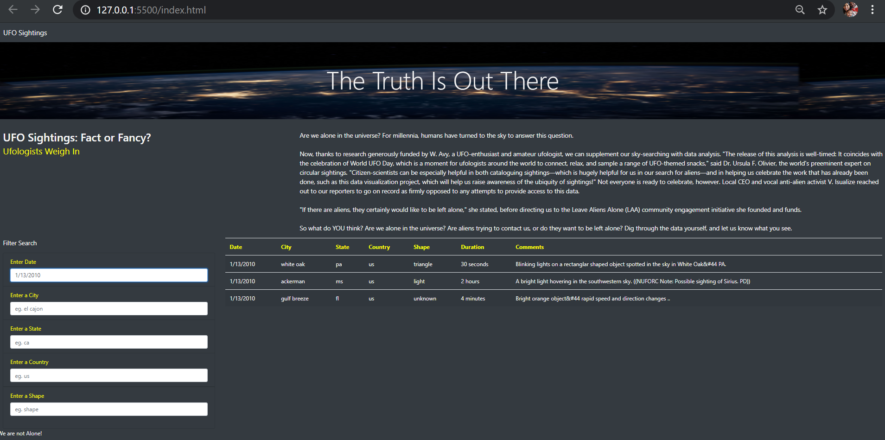

# UFO-s
Customizing a webpage using bootstrap, equip tables from data stored in a javaScript array with many functional filters that will allow interaction with visualization to the user. All this will be put into an HTML file for easy viewing.

## Purpose 
- To create a basic html webpage that would dhow results in tabular form with filters to narrow down an incident that was recorded in regards to UFO sightings.
- This webpage was modified to incorpporate additional filters, providing Dana and other users further insight with just a click. 

## Resources
- Visual Studio code v1.50.1
- HTML / CSS
- JavaScript 
- data.js (data file)

## Results
- AS expected, the sightings recorded were dispayed when filtered.
- The webpage looks attractive even though being very basic. 

- The webpage is designed to keep the user in mind and to make this as friendly as possiblr. 
- The user can input values in fields desired to narrow down a particular data, city, state, country or UFO attributes (eg. shape)
- Below is an example of filtered data of date in interest (Jan 13th 2010)

- Another filter applied is the state CO (Colorado)

## Summary 
- A drawback to this code is not having a clear (filter fields button).
- The filtered table data does not clear unless the fields are clear adn retyped from the begining. (cannot overwrite and run the filters.)
- The data is only 

    #### Improvements to consider
    - search by partial text rather than be restrictive to exact word search.
    - How will new or recent data be added into data.
    - An alert if a filter that was entered is not available or incorrect. 
    - A drop down of the filters would be good, as the data is not very large.